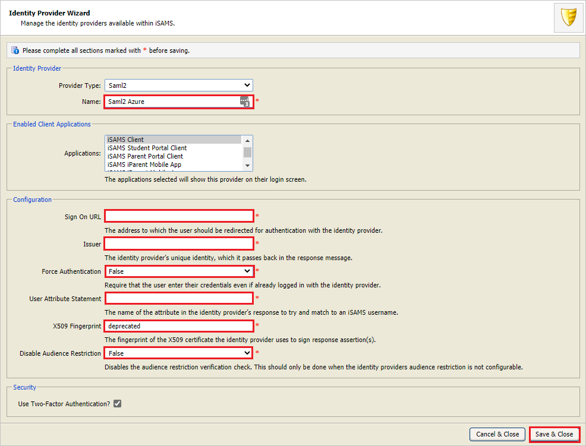
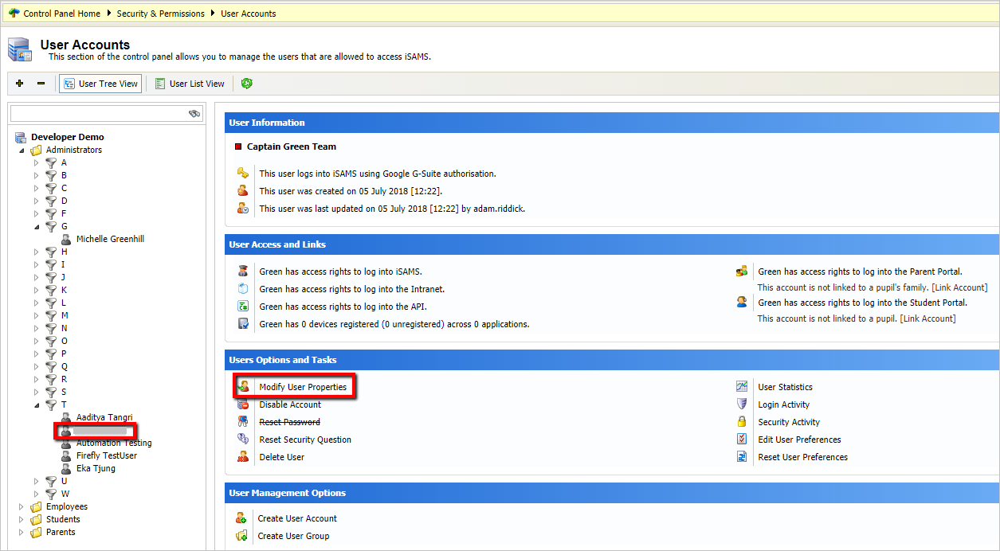

# Tutorial: Azure Active Directory single sign-on (SSO) integration with iSAMS

In this tutorial, you'll learn how to integrate iSAMS with Azure Active Directory (Azure AD). When you integrate iSAMS with Azure AD, you can:

* Control in Azure AD who has access to iSAMS.
* Enable your users to be automatically signed-in to iSAMS with their Azure AD accounts.
* Manage your accounts in one central location - the Azure portal.

To learn more about SaaS app integration with Azure AD, see [What is application access and single sign-on with Azure Active Directory](https://docs.microsoft.com/azure/active-directory/manage-apps/what-is-single-sign-on).

## Prerequisites

To get started, you need the following items:

* An Azure AD subscription. If you don't have a subscription, you can get a [free account](https://azure.microsoft.com/free/).
* iSAMS single sign-on (SSO) enabled subscription.

## Scenario description

In this tutorial, you configure and test Azure AD SSO in a test environment.

* iSAMS supports **SP and IDP** initiated SSO
* Once you configure iSAMS you can enforce session control, which protects exfiltration and infiltration of your organization’s sensitive data in real time. Session control extends from Conditional Access. [Learn how to enforce session control with Microsoft Cloud App Security](https://docs.microsoft.com/cloud-app-security/proxy-deployment-any-app).

## Adding iSAMS from the gallery

To configure the integration of iSAMS into Azure AD, you need to add iSAMS from the gallery to your list of managed SaaS apps.

1. Sign in to the [Azure portal](https://portal.azure.com) using either a work or school account, or a personal Microsoft account.
1. On the left navigation pane, select the **Azure Active Directory** service.
1. Navigate to **Enterprise Applications** and then select **All Applications**.
1. To add new application, select **New application**.
1. In the **Add from the gallery** section, type **iSAMS** in the search box.
1. Select **iSAMS** from results panel and then add the app. Wait a few seconds while the app is added to your tenant.

## Configure and test Azure AD SSO for iSAMS

Configure and test Azure AD SSO with iSAMS using a test user called **B.Simon**. For SSO to work, you need to establish a link relationship between an Azure AD user and the related user in iSAMS.

To configure and test Azure AD SSO with iSAMS, complete the following building blocks:

1. **[Configure Azure AD SSO](#configure-azure-ad-sso)** - to enable your users to use this feature.
    1. **[Create an Azure AD test user](#create-an-azure-ad-test-user)** - to test Azure AD single sign-on with B.Simon.
    1. **[Assign the Azure AD test user](#assign-the-azure-ad-test-user)** - to enable B.Simon to use Azure AD single sign-on.
1. **[Configure iSAMS SSO](#configure-isams-sso)** - to configure the single sign-on settings on application side.
    1. **[Create iSAMS test user](#create-isams-test-user)** - to have a counterpart of B.Simon in iSAMS that is linked to the Azure AD representation of user.
1. **[Test SSO](#test-sso)** - to verify whether the configuration works.

## Configure Azure AD SSO

Follow these steps to enable Azure AD SSO in the Azure portal.

1. In the [Azure portal](https://portal.azure.com/), on the **iSAMS** application integration page, find the **Manage** section and select **single sign-on**.
1. On the **Select a single sign-on method** page, select **SAML**.
1. On the **Set up single sign-on with SAML** page, click the edit/pen icon for **Basic SAML Configuration** to edit the settings.

   

1. On the **Basic SAML Configuration** section, if you wish to configure the application in **IDP** initiated mode, enter the values for the following fields:

    a. In the **Identifier** text box, type a URL using the following pattern:
    `https://<SUBDOMAIN>.isams.cloud/main/sso/saml2`

    b. In the **Reply URL** text box, type a URL using the following pattern:
    `https://<SUBDOMAIN>.isams.cloud/main/sso/saml2/acs`

1. Click **Set additional URLs** and perform the following step if you wish to configure the application in **SP** initiated mode:

    In the **Sign-on URL** text box, type a URL using the following pattern:
    `https://<SUBDOMAIN>.isams.cloud/`

	> [!NOTE]
	> These values are not real. Update these values with the actual Identifier, Reply URL and Sign-on URL. Contact [iSAMS Client support team](mailto:support@isams.com) to get these values. You can also refer to the patterns shown in the **Basic SAML Configuration** section in the Azure portal.

1. On the **Set up single sign-on with SAML** page, In the **SAML Signing Certificate** section, click copy button to copy **App Federation Metadata Url** and save it on your computer.

	

### Create an Azure AD test user

In this section, you'll create a test user in the Azure portal called B.Simon.

1. From the left pane in the Azure portal, select **Azure Active Directory**, select **Users**, and then select **All users**.
1. Select **New user** at the top of the screen.
1. In the **User** properties, follow these steps:
   1. In the **Name** field, enter `B.Simon`.  
   1. In the **User name** field, enter the username@companydomain.extension. For example, `B.Simon@contoso.com`.
   1. Select the **Show password** check box, and then write down the value that's displayed in the **Password** box.
   1. Click **Create**.

### Assign the Azure AD test user

In this section, you'll enable B.Simon to use Azure single sign-on by granting access to iSAMS.

1. In the Azure portal, select **Enterprise Applications**, and then select **All applications**.
1. In the applications list, select **iSAMS**.
1. In the app's overview page, find the **Manage** section and select **Users and groups**.

   

1. Select **Add user**, then select **Users and groups** in the **Add Assignment** dialog.

	

1. In the **Users and groups** dialog, select **B.Simon** from the Users list, then click the **Select** button at the bottom of the screen.
1. If you're expecting any role value in the SAML assertion, in the **Select Role** dialog, select the appropriate role for the user from the list and then click the **Select** button at the bottom of the screen.
1. In the **Add Assignment** dialog, click the **Assign** button.

## Configure iSAMS SSO

1. Log in to iSAMS as an Administrator.

1. Navigate to the Control Panel and open the **Authentication** module.
1. From the right-hand menu, select **Identity Providers**

    

1. Select **Add Provider**

    

1. Perform the following steps in the following page:

    

    a. In the **Name** textbox, give a valid name like `Saml2 Azure`

    b. In the **Sign On URL** textbox, paste the **Login URL** value which you have copied from the Azure portal.

    c. In the **Issuer** textbox, paste the **Entity ID** value which you have copied from the Azure portal.

    d. Set the **Force Authentication** to **False** from dropdown.

    e. Fill the **User Attribute Statement** textbox with a valid username.

    f. Open the downloaded **Certificate** from the Azure portal into Notepad and paste the content into the **X509 Fingerprint** textbox.

    g. Set the **Disable Audience Restriction** value to **False** from the dropdown.

    h. Click on **Save & Close**.

### Create iSAMS test user

1. Log in to iSAMS as an Administrator.

2.  Go to the **Control Panel Home** -> **Security & Permissions** -> **User Accounts** -> **User Options & Tasks** -> **Modify User Properties**

    

3. In the resulting popup window, select the **Account Details** tab, and change the **Authorization** to that of your newly created Identity Provider.

    

4. Click on **Save & Close**.

## Test SSO 

In this section, you test your Azure AD single sign-on configuration using the Access Panel.

When you click the iSAMS tile in the Access Panel, you should be automatically signed in to the iSAMS for which you set up SSO. For more information about the Access Panel, see [Introduction to the Access Panel](https://docs.microsoft.com/azure/active-directory/active-directory-saas-access-panel-introduction).

## Additional resources

- [ List of Tutorials on How to Integrate SaaS Apps with Azure Active Directory ](https://docs.microsoft.com/azure/active-directory/active-directory-saas-tutorial-list)

- [What is application access and single sign-on with Azure Active Directory? ](https://docs.microsoft.com/azure/active-directory/active-directory-appssoaccess-whatis)

- [What is conditional access in Azure Active Directory?](https://docs.microsoft.com/azure/active-directory/conditional-access/overview)

- [Try iSAMS with Azure AD](https://aad.portal.azure.com/)

- [What is session control in Microsoft Cloud App Security?](https://docs.microsoft.com/cloud-app-security/proxy-intro-aad)
