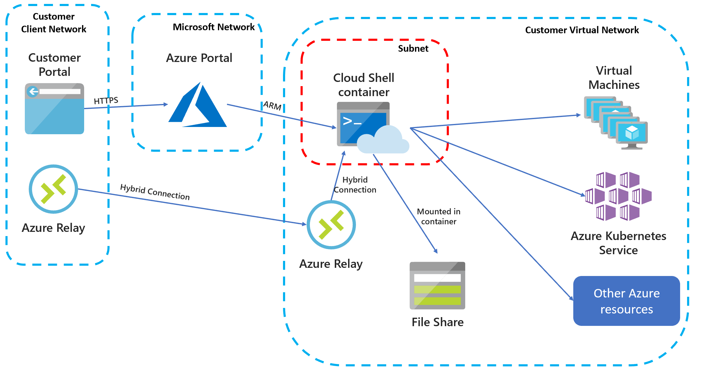
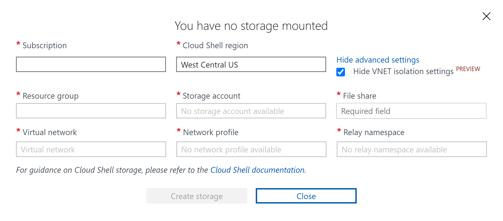

# Deploy Cloud Shell into an Azure virtual network
> [!NOTE]
> This functionality is in public preview.

[Azure Virtual Network](../virtual-network/virtual-networks-overview.md) provides secure, private networking for your Azure and on-premises resources. By deploying Cloud Shell into an Azure virtual network, You can communicate securely with other resources in the virtual network. A regular Cloud Shell session runs in a container in a Microsoft network separate from your resources. This means that you could not access your resources (such as VMs or storage accounts) that can only be accessed from a specific virtual network.  Using Cloud Shell in your virtual network, you can execute commands in a container running in your own Azure Virtual Network.

Below you can see the resource architecture that will be deployed and used in this scenario.

Before you can use Cloud Shell in your own Azure Virtual Network, you will need to create several resources to support this functionality. This article shows how to set up the required resources to deploy Azure Cloud Shell to a virtual network via an ARM template provided.

> [!NOTE]
> These resources only need to be setup once for the virtual network. They can then be shared by all administrators with access to the virtual network.

## Required network resources

### Virtual network
A virtual network defines the address space in which one or more subnets are created.

The desired virtual network to be used for Cloud Shell needs to be identified, this will usually be an existing virtual network that contains resources you would like to manage or a network that peers with networks that contain your resources.

### Subnet
A subnet segments the virtual network into separate address spaces usable by the Azure resources placed in them.  There can be multiple subnets in a virtual network.

Within the selected virtual network, a dedicated subnet must be allocated for Cloud Shell, specifically for the Azure Container Instances (ACI) service.  When a user requests a Cloud Shell container in a virtual network, Cloud Shell uses ACI to create a container that is in this delegated subnet.  No other resources can be in this subnet.

> [!NOTE] 
> The subnet that is used for Cloud Shell must be left empty of other resources.

### Network profile
A network profile is a network configuration template for Azure resources that specifies certain network properties for the resource.

### Azure Relay
An [Azure Relay](https://docs.microsoft.com/azure/azure-relay/relay-what-is-it) allows two endpoints that are not directly reachable to communicate. In this case, it is used to allow the administrator's browser to communicate with the container in the private network.

The Azure Relay instance used for Cloud Shell can be configured to control which networks can access container resources: 
- Accessible from the public internet: In this configuration, Cloud Shell provides a way to reach otherwise internal resources from outside. 
- Accessible from specified networks: In this configuration, administrators will have to access the Azure portal from a computer running in the appropriate network to be able to use Cloud Shell.

## Storage requirements
As required with standard Cloud Shell, a storage account is required while using Cloud Shell in a virtual network. Each administrator needs a file share to store their files.  The storage account needs to be accessible by the virtual network that is used by Cloud Shell. If the location of the file share is not accessible from the browser when Cloud Shell is running, the user will not be able to create the storage account and file share via Cloud Shell.  If this is the case, the user will need to create these resources ahead of time via the Azure portal or some other management tool. 

## Virtual network deployment limitations
* Due to the additional networking resources involved, starting Cloud Shell in a virtual network is typically slower than a standard Cloud Shell session.
* There may be less region support for Cloud Shell in a virtual network compared to standard Cloud Shell. This is currently limited to: WestUS and WestCentralUS.
* [Azure Relay](https://docs.microsoft.com/azure/azure-relay/relay-what-is-it) is not a free service, please view their [pricing](https://azure.microsoft.com/pricing/details/service-bus/).

## Deploy network resources
 
### Create a resource group and virtual network
If you already have a desired VNET that you would like to connect to, skip this section.

In the Azure portal, or using Azure CLI, Azure PowerShell, etc. create a resource group and a virtual network in the new resource group, **the resource group and virtual network need to be in the same region**.

> [!NOTE]
> While in public preview, the resource group and virtual network must be located in either WestCentralUS or WestUS.

### ARM templates
Utilize the [Azure Quickstart Template](https://aka.ms/cloudshell/docs/vnet/template) for creating Cloud Shell resources in a virtual network, and the [Azure Quickstart Template](https://aka.ms/cloudshell/docs/vnet/template/storage) for creating necessary storage. Take note of your resource names, primarily your file share name.

### Open relay firewall
Navigate to the relay created using the above template, select "Networking" in settings, allow access from your browser network to the relay.

### Connecting resources with Cloud Shell
> [!NOTE]
> This set must be completed for each administrator will use Cloud Shell.

After deploying completing the above steps, navigate to Cloud Shell in the Azure portal or on shell.azure.com.

> [!NOTE]
> If Cloud Shell has been used in the past, the existing clouddrive must be unmounted. To do this run `clouddrive unmount` from an active Cloud Shell session, refresh your page.

Connect to Cloud Shell, you will be prompted with the first run experience. Select your preferred shell experience, select "Show advanced settings" and select the "Show VNET isolation settings" box. Fill in the fields in the pop-up.  Most fields will autofill to the available resources that can be associated with Cloud Shell in a virtual network.  The File Share name will have to be filled in by the user.

## Next steps
[Learn about Azure Virtual Networks](https://docs.microsoft.com/azure/virtual-network/virtual-networks-overview)
