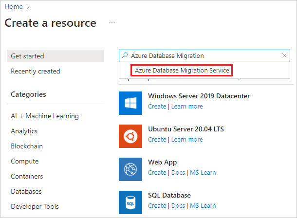

## Create an Azure Database Migration Service instance

1. In the Azure portal menu or on the **Home** page, select **Create a resource**. Search for and select **Azure Database Migration Service**.

    

2. On the **Azure Database Migration Service** screen, select **Create**.

    

    Select the option **Continue to use Azure Database Migration Service**.

    

3. On the **Create Migration Service** basics screen:

     - Select the subscription.
     - Create a new resource group or choose an existing one.
     - Specify a name for the instance of the Azure Database Migration Service.
     - Select the location in which you want to create the instance of Azure Database Migration Service.
     - Choose **Azure** as the service mode.
     - Select a pricing tier. For more information on costs and pricing tiers, see the [pricing page](https://aka.ms/dms-pricing).

    

     - Select **Next: Networking**.

4. On the **Create Migration Service** networking screen:

    - Select an existing virtual network or create a new one. The virtual network provides Azure Database Migration Service with access to the source server and the target instance. For more information about how to create a virtual network in the Azure portal, see the article [Create a virtual network using the Azure portal](../articles/virtual-network/quick-create-portal.md).

    

    - Select **Review + Create** to review the details and then select **Create** to create the service.

